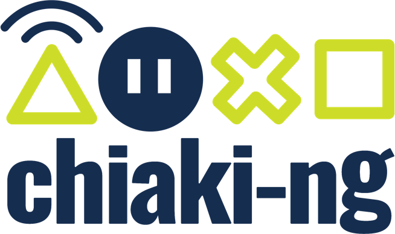

# Vitaki-ng

An open source PlayStation Remote Play project specifically designed for PlayStation Vita users, currently in an experimental phase. The goal is to explore the technical feasibility of adding Vita support to the main Chiaki-ng codebase. Investigating how different the underlying code must be, and whether long-term integration is practical without burdening the upstream project.

Feel free to contribute to the discussion and experimentation.

## Reference/Upstream projects
- [chiaki-ng](https://streetpea.github.io/chiaki-ng)
- [vitaki-fork](https://github.com/ywnico/vitaki-fork) - `30a787709de0fbc555c5c7b8b9f9a8ee4a7f64e8`
- [aa's chiaki vita port](https://git.catvibers.me/aa/chiaki)
- [chiaki](https://sr.ht/~thestr4ng3r/chiaki/)

## Disclaimer
This project is not endorsed or certified by Sony Interactive Entertainment LLC.

Chiaki is a Free and Open Source Software Client for PlayStation 4 and PlayStation 5 Remote Play licensed under [GNU AGPL
Version 3](LICENSES/AGPL-3.0-only-OpenSSL.txt).
